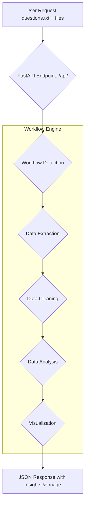

# 📊 AI-Powered Data Analyst Agent 🤖

[](https://opensource.org/licenses/MIT)

An AI-driven data analysis assistant that can scrape, clean, analyze, and visualize data—all from plain English instructions. 📝

## 🚀 Overview

This project is a powerful, AI-driven Data Analyst Agent built with **FastAPI** and **LangChain**. It provides a REST API that understands natural language instructions to perform complex data analysis workflows, from web scraping to insight generation.

The agent follows a modular workflow:

1.  **Source data** (from web pages or uploaded files) 📂
2.  **Process & clean** it automatically 🧹
3.  **Perform advanced analysis** (statistics, trends, key findings) 🧠
4.  **Generate dynamic visualizations** (returned as base64-encoded images) 📈
5.  **Return structured JSON insights**, even if the task times out 💡

## ✨ Key Features

  * **🗣️ Natural Language Understanding**: Describe your analysis task in a `.txt` file.
  * **📂 Multi-Modal Input**: Accepts a `questions.txt` plus optional files (`.csv`, `.xlsx`, `.png`, etc.).
  * **🌐 Automated Web Scraping**: Extracts and parses data directly from web pages.
  * **🧹 Data Cleaning & Processing**: Automatically handles missing values, formatting, and transformation.
  * **📈 Advanced Analysis**: Performs statistical summaries, trend detection, and insight extraction.
  * **📊 Dynamic Visualization**: Creates charts (scatterplots, histograms, etc.).
  * **⚡ Robust & Scalable**: FastAPI backend, Docker-ready for deployment.
  * **⏱️ Graceful Timeouts**: Always returns a structured JSON response (even if \>5 min).

-----

## Workflow



-----

## 📦 Getting Started

### 1️⃣ Prerequisites

  * Python 3.10+
  * Docker
  * LLM API key (e.g., **OpenAI**, **Google Gemini**)

-----

### 2️⃣ Installation

```bash
git clone https://github.com/shreeramiitm/data-analyst-agent-V2.git
cd data-analyst-agent-V2
python -m venv venv
source venv/bin/activate   # On Windows: venv\Scripts\activate
pip install -r requirements.txt
```

-----

## 🛠️ Technology Stack

  * **Backend**: FastAPI
  * **AI/LLM**: LangChain, OpenAI
  * **Data Manipulation**: Pandas, NumPy
  * **Visualization**: Matplotlib, Scipy
  * **Web Scraping**: Requests, BeautifulSoup
  * **Deployment**: Docker

-----

## 📜 License

This project is licensed under the MIT License - see the [LICENSE](https://www.google.com/search?q=LICENSE) file for details.
